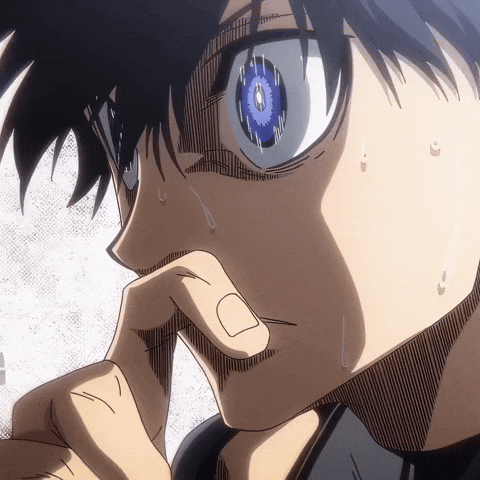

<h1 align="center">Hi 👋, I'm Hassan Mohamed</h1>
<h3 align="center">Embedded Systems Developer | PCB Designer | App & Web Developer</h3>

  

  I love working with electronics, embedded systems, PCB design, and building interactive apps and websites.

  

---

### About Me

- Embedded Systems developer from Egypt  
- Interested in electronics, PCB design, and smart systems  
- Also working with app and web development  
- I like building things that are both useful and visually polished  

 

---

### GitHub Stats

  

  

 

---

### Most Used Languages

  

 

---

### Spotify 

 
   

 

---

### Tech Stack

  

### Currently Interested In

- Embedded systems and automation
- PCB design and electronics prototyping
- App development
- Modern interactive web interfaces

 

---

### Connect With Me

  
  
  
  
  
  

---

### Contribution Snake

  

